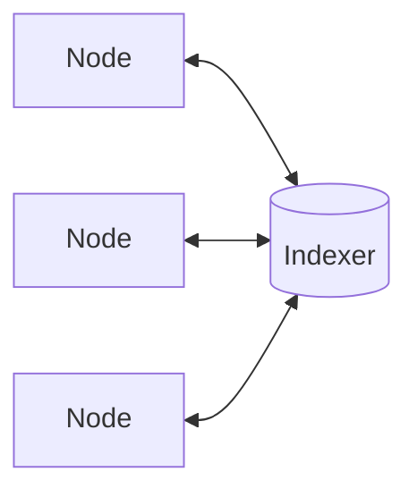

# Blockchain Basics: P2P

We have already seen that traditional Web 2.0 systems are centralized: how can we create a more resilient system where we do not have to rely on a single source of truth? Historically, **P2P networks** have been the solution to this.

> **P2P** is an _overlay network that allows connections over nodes that are not physically connected_.

> A **node** is a decentralized server in a P2P network.

## Historical P2P Networks

### Napster

### Gnutella

### Bitorrent

## P2P Attack Vectors

## Disadvantages of P2P
