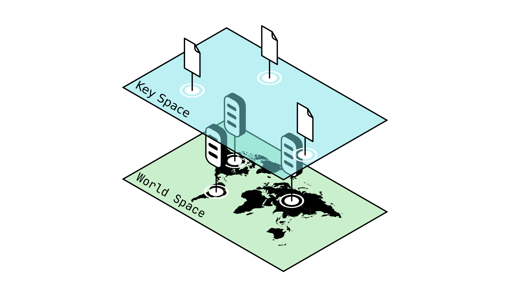
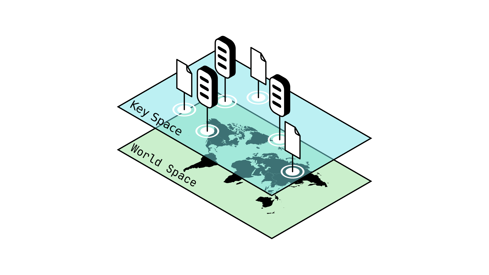

# Inter-Node communication with Chord

P2P networks consist of a _decentralized array of servers_. These Nodes are arranged around the world and owned by many different individuals. When you want to communicate with someone across the world, you can send them a letter (yes, very archaic): for that you need that person's address. Similarly, if we want the Nodes in a P2P network to be able to communicate between each other, we need a way to organize them into a unique network.

> We cannot rely on existing techniques such as IP addresses, since they need to be recognized by a _centralized_ entity to function. Ideally, we want our P2P network to be able to keep functioning _independently of the rest of the web._

As an alternative, each Node issues itself a random number, which acts as a **G**lobal **U**nique **I**dentifier, or **GUID**. But how is this possible? what if two _different Nodes_ issue themselves the _same_ GUID? This is known as a **collision**.

> A **collision** in cryptographic terms refers to when a function gives the same output for two different inputs. This is an issue when we need outputs to be unique for identification purposes for example.
>
> _Collisions are generally seen as vulnerabilities and a potential attack vector._

Consider the following example: you and 4 of your friends are playing a guessing game. You each guess a random number between 1 and 4, and whoever manages to choose a unique number first wins. In this game, it is highly likely for there to be collisions in you answer because the space of possible answers is so small.

Now imagine instead that you and your friends can guess any number between 0 and 1 000 000. The odds of two players guessing the same number becomes very low, to the point where it is _negligible_ (meaning this is so unlikely to happen we can ignore it).

Similarly, it should be evident that _as long as the amount of possible guesses is much larger than the amount of Nodes in a network_, then the risk of two Nodes guessing the same GUID is very low and even negligible. To achieve this, we use a specific kind of function called a **pseudorandom hash function** to make our random guess.

> A **pseudorandom hash function** is a function whose output is deterministic -that is to say it will always give the same output for a given input- but appears random. This means that if you were to show someone the output of a pseudorandom hash function, they should be unable to tell that the output is deterministic.
>
> _You can see pseudorandom hash functions as a kind of_ scrambler: _such a function takes as an input a number and outputs something vastly different each time, such that each output seems unrelated to the previous one, appearing to be random._

At this point we have determined how to associate a unique address to each Node, but how can we communicate between these Nodes? For that we need to dive deeper into the way P2P networks exchange information.

## Cryptographic Hash Functions

At its heart, the primary service a P2P provides is a _decentralized way to exchange information_. But how do we locate this information?

If you want to find a book in a library, you refer to it's title, the author that wrote it, and perhaps even the publishing company: all sorts of unique information that make up the book's _identity_. A very _inefficient_ way to search for a book would be to parse though every book in the library and look for one where every letter in it matches the expected value.

Similarly, if you want to access some data stored in a P2P network, you need some way of _identifying_ it. It would be inefficient to send large amounts of data over the network, so instead we rely on **cryptographic hash functions**.

> A **cryptographic hash function** is a function which satisfies the following properties:
>
> - Given any input it will return an output of fixed (small) length.
> - The output of such a function should be _deterministic_.
> - It should have a negligibly low probability of any _collision_ occurring.
>
> The input passed to a cryptographic hash function can be many things: a number, a very long text, or some other kind of information.

Let's break this down step by step.

First of all, the output of a cryptographic hash function is generally much smaller than it's input: in that way it allows us to shorten the identity of the data we are passing to it, similarly to how the title of a book and it's author provide a shorter identity when compared to the entire contents of the book itself.

Since this output is _deterministic_, this means that given a same input we will always get the same output from a cryptographic hash function. This is important since we want to use this output as a guarantee of identity: it would be inconvenient if that identity were to change each time we used it.

Finally, the probability of a collision occurring with a cryptographic hash function should be _negligibly low_. This is important because we do not want malicious actors to be able to create duplicate or false identities.

> Among many other things, cryptographic hash functions can be seen as a _guarantee of authenticity_. They allow us to represent the identity of any kind of data in a short and concise way that is unique to that input.

## Routing Tables

## Joining a P2P Network

