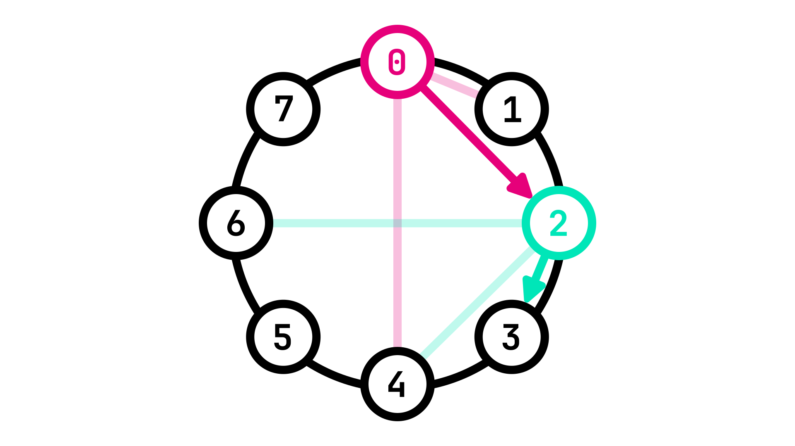

# Inter-Node communication with Chord

So far we have seen [how to identify nodes in a P2P network](./p2p_identity.md), yet it is still unclear how Nodes actually _communicate_ between each other. There are many different algorithms that achieve this. Over the next two sections, we will be focusing on how **Chord** and **Kademlia** can be used for this very purpose.

> Since **Kademlia** is a modified version of **Chord**, we will only be exploring Chord in this context, in particular regarding how Nodes determine _which_ other nodes to connect to. We will _not_ therefore be diving into a full explanation of the [original Chord paper](./res/pdf/chord_sigcomm.pdf).

## Routing Tables

\\(m := \text{number of peers in the routing table.}\\)

\\(n := \text{node GUID.}\\)

\\(k := k^{th} \text{peer in the routing table}\\)

> \\[peer[k] = n + 2^{k-1} \mod 2^m\\]

_Fig. 1: Identifier circle showing the \\(m\\) peers of Node 0_

_Fig. 2: Identifier circle showing the \\(m\\) peers of Nodes 0, 1 and 2_

_Fig. 3: Successive peers allow for efficient \\(O(\log(n))\\) traversal of the network_

## Joining a P2P Network

_Fig. 4: A new Node \\(n\\) joining the network by connecting to a Boot Node_

