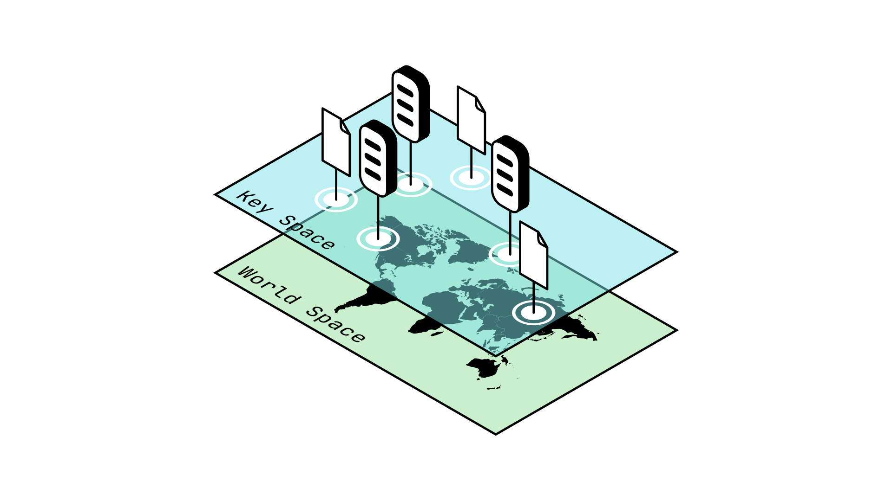
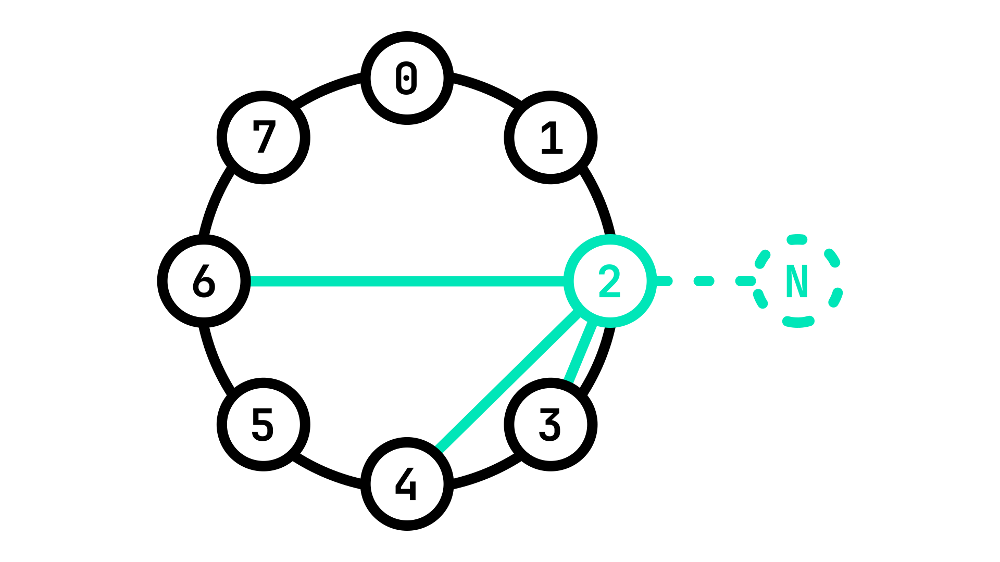

# Inter-Node communication with Chord

P2P networks consist of a _decentralized array of servers_. These Nodes are arranged around the world and owned by many different individuals. When you want to communicate with someone across the world, you can send them a letter (yes, very archaic): for that you need that person's address. Similarly, if we want the Nodes in a P2P network to be able to communicate between each other, we need a way to organize them in that network.

> We cannot rely on existing techniques such as IP addresses, since they need to be recognized by a _centralized_ entity to function. Ideally, we want our P2P network to be able to keep functioning _independently of the rest of the web._

As an alternative, each Node issues itself a random number, which acts as a **G**lobal **U**nique **I**dentifier, or **GUID**. But how is this possible? what if two _different Nodes_ issue themselves the _same_ GUID? This is known as a **collision**.

> A **collision** in cryptographic terms refers to when a function gives the same output for two different inputs. This is an issue when we need outputs to be unique for identification purposes for example.
>
> _Collisions are generally seen as vulnerabilities and a potential attack vector._

Consider the following example: you and 4 of your friends are playing a guessing game. You each guess a random number between 1 and 4, and whoever manages to choose a unique number first wins. In this game, it is highly likely for there to be collisions in you answer because the space of possible outputs is so small.

Now imagine instead that you and your friends can guess any number between 0 and 1 000 000. The odds of two players guessing the same number becomes very low, to the point where it is _negligible_ (meaning this is so unlikely to happen we can ignore it).

Similarly, it should be evident that _as long as the amount of possible guesses is much larger than the amount of Nodes in a network_, then the risk of two Nodes guessing the same GUID is very low and even _negligible_. In this case, we are using a specific kind of function called a **pseudorandom hash function** to make our random guess.

> A **pseudorandom hash function** is a function whose output is deterministic -that is to say it will always give the same output for a given input- but appears random. This means that if you were to show someone the output of a pseudorandom hash function, they should be unable to tell that the output is _not_ random.
>
> _You can see pseudorandom hash functions as a kind of_ scrambler: _such a function takes as an input a number and outputs something vastly different each time, such that each output seems unrelated to the previous one, appearing to be random._

At this point we have determined how to associate a unique address to each Node, but how can we communicate between these Nodes? For that we need to dive deeper into the way P2P networks exchange information.

## Information Exchange in P2P Networks

## Routing Tables

## Joining a P2P Network

