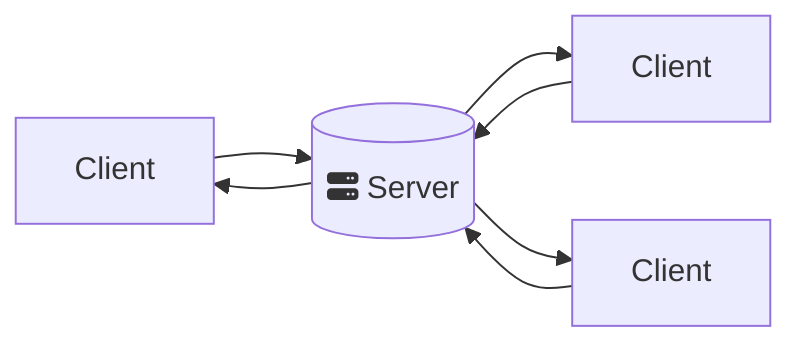
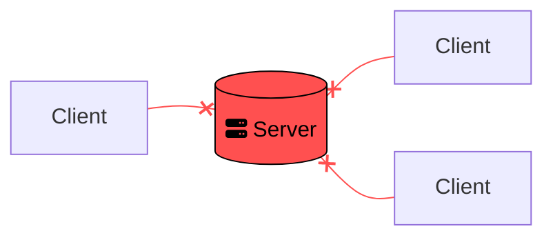
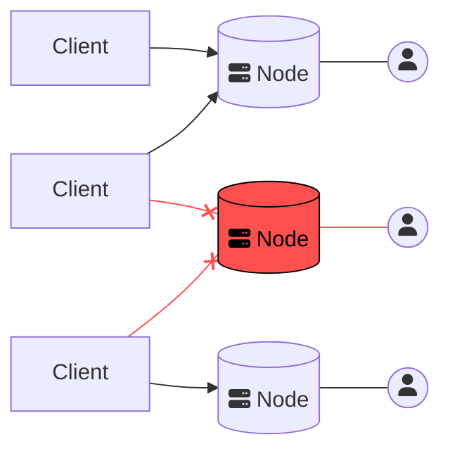
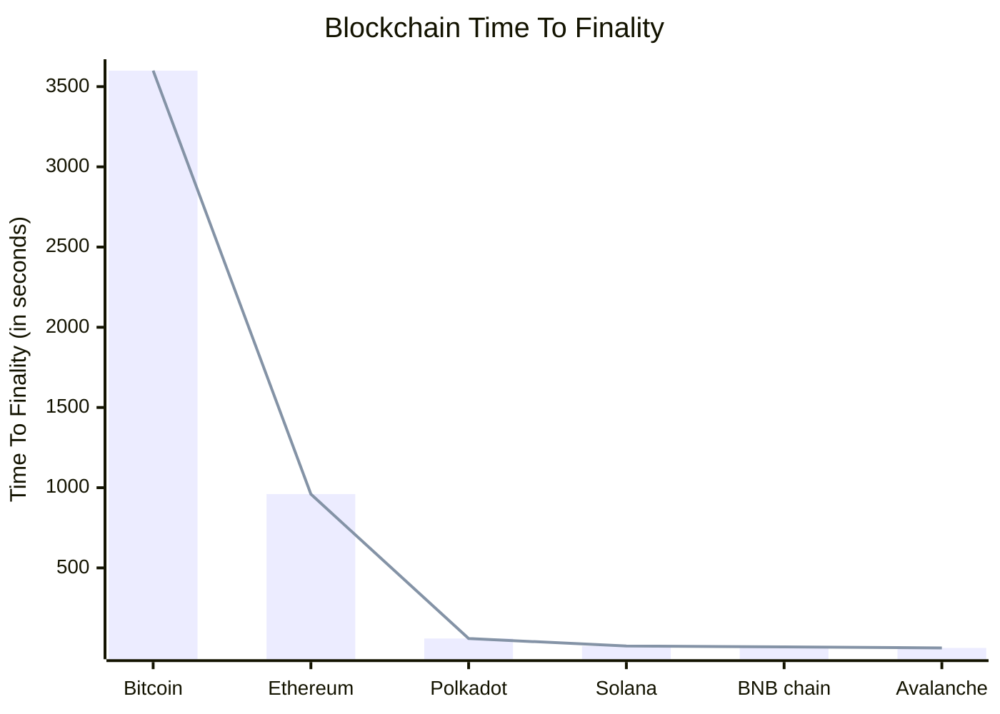

# P2P networking

Most online services in Web 2.0 follow a simple **client-server** architecture, where a _client_ (the person using the service) makes a request to a centralized server belonging to the _service provider_. This centralized server then sends a response to the client which satisfies the initial request.

> **Facebook** is a good example of a client-server model: when you like a post, a request is sent to the Devi- ahem Facebook servers. These in turn register your like and send an updated version of the like count to other users who are seeing the same post.

_Fig. 1: A typical client-server architecture_

What happens however if this server was to _shut down_? We refer to this sort of dependency on a single component as a _centralized vulnerability_.

> **Centralized vulnerability** occurs when a system relies entirely on one of its components to function: if that component were to stop functioning, it would affect the rest of the system.
>
> ex: _Fuel is a centralized vulnerability in a car. If a car runs out of fuel, it stops working. There is no alternative that can take its place._

In the case of our client-server model, this is an issue since it means that any client, or user, trying to connect to a failing server will not be able to use the service it usually provides.[^1]

_Fig. 2: Services which rely on client-server architectures are vulnerable to outages_

There is an easy solution to this: add more servers! That way if one stops working, another one will be able to take its place. While this might protect us from outages and external malicious attacks, it does not protect us from _internal malicious attacks_.

> Even with multiple redundant servers, there still exists a single entity with absolute power over the service it provides. Nothing prevents that entity from abusing that power by choosing to restrict certain users for example, or censoring content it does not approve of.

## Decentralized servers

**P**ier to **P**ier networking, or (P2P), describes a network in which there resides no central authority with absolute power over the services it provides.

> Some examples of popular P2P networks include [Gnutella](https://en.wikipedia.org/wiki/Gnutella) and [Bittorent](https://www.bittorrent.com/).[^2]

P2P networks function by allowing anyone to enter as a server, also called a _Node_. Crucially, every Node should have the same power of influence over the network. That way, there is no centralized point of failure.

_Fig. 3: A typical P2P network_

As opposed to the typical client-server model, P2P networks distribute the data and computation they require over every Node in the network, with data being saved in multiple copies. That way, even if a single Node goes offline, another Node can take its place.

As you can see in figure 3, even if a single Node in a P2P network goes down, users can simply connect to another Node to access the service provided by the network. Each node can be individually owned by a unique uperator, with the largest networks boasting millions of Nodes and still no central point of failure.

## Drawbacks of P2P networks

### 1. Speed

Not all P2P networks are necessarily slower than centralized alternatives, and can actually prove to be faster in certain cases. This makes sense if you consider how a P2P network like BitTorrent breaks up the load of storing data across multiple Nodes: instead of a single server storing the entirety of a file, each Node stores only a portion of each file.

This in turn allows us to download multiple parts of a file at once, which can be an advantage for popular files which are available over many different nodes. This kind of situation becomes more complicated for systems with stronger cryptographic guarantees, such as Blockchain, where the cost of computation generally outweighs the advantages of data being available across multiple Nodes in a network.

_Fig. 4: Chart of Blockchain Time To Finality._ [source](https://chainspect.app/dashboard)

**T**ime **T**o **F**inality, or **TTF**, is a measure of how long it takes for information to be considered 'valid' on a Blockchain. As you can see in Fig. 4, current Blockchain P2P networks are still a far cry away from the instantaneous response times of centralized systems.

It is possible however to imagine a future where advances in algorithms and hardware have allowed Blockchain technologies to operate on a level comparable or even faster in certain cases than traditional Web 2.0 alternatives. This is already evidenced by networks such as Avalanche or Solana, although whether Solana is a decentralized network as of the time of writing is arguable.

### 2. Initial adoption

Another issue with these networks is that they are above all _social networks_. This means that a P2P network lives and dies by its users: unlike a centralized service, there is no corporate entity to pour in large sums of money to pay for server upkeep. If there are no users, and no Nodes, then there is no network. Conversely, the more users a P2P network has, the more effective it becomes.

> This is know as the **Network Effect**, which states that a service gains additional value as more people use it. The inverse is also true, such that a service with a low user count has lower value.

This can be seen as a positive aspect, as P2P services naturally grow or shrink in response to their popularity, but it also means that it can be especially hard for a P2P network to take off in its infancy, when it only has very few Nodes.

### 3. Legal challenges

Finally, the most glaring issue of P2P networks is their **alegality**.

> **Alegality** describes a status which is neither legal or illegal, but rather exists outside of the effect of the law, ie: the law has no power over an alegal entity.
>
> _While P2P networks might be alegal, the developers creating them most certainly are not, and can be indited, prosecuted and punished by the law._

As a result of the lack of centralized points of failure, P2P networks are _especially_ hard to stop, to the point that given a sufficiently large community this might be _impossible_. This can make them a safe haven for illegal services, such as piracy, pornography or gambling.

This is significant since historically, the developers or companies behind P2P networks _have been held responsible_ for any illegal activity facilitated by the network they were developing.[^3] This has especially been the case for copyright infringement.

**Be very advised when creating a P2P network that you are essentially building something that <u>will</u> escape your control. You should have taken <u>especially</u> good care you risk no legal responsibility for the activities which take place on the network you are developing, else you risk enjoying a pretty view onto a concrete wall and iron bars for the rest of your life. Consult a lawyer for goodness sake.**

## When to use a P2P network

In conclusion, while P2P networks have their drawbacks, they offer considerable engineering advantages in terms of **resilience** and **data availability**.

> At their core, P2P technologies are best suited for use in adversarial situations such as military applications[^4], censorship resistance, and high bandwidth networks with many worldwide concurrent (simultaneous) request for data.

While the legal implications associated with P2P networks are daunting, they are an extremely useful tool in the fight against centralized points of vulnerability, and probably the only one to be truly effective.

---

[^1]: The [CloudStrike Blue Screen of Death](https://blogs.microsoft.com/blog/2024/07/20/helping-our-customers-through-the-crowdstrike-outage/) disaster which took place on the 18th of July 2024 is a perfect example of the dangers than can arise from centralized vulnerability, with an estimated 8.5 million systems affected worldwide as a result of the mistakes of a single company. This was possible due to an auto-update feature in ClowdStrike's Falcon software. While this was arguably a pipeline and testing issue, it also demonstrates the dangers associated in entrusting so much power in a single entity.

[^2]: [Napster](https://en.wikipedia.org/wiki/Napster) might also come to mind, however while it utilized P2P techniques it still relied on a centralized indexing server for retrieving information in the network. While it was still possible for people to set up their own indexing server as was the case during the [Metallica](https://en.wikipedia.org/wiki/Napster#Legal_challenges) debacle, this still meant not all nodes were treated equal, so Napster cannot be considered a 'true' P2P network.

[^3]: In 2009, popular P2P torrenting website [The Pirate Bay](https://thepiratebay.org/index.html) faced [legal action](https://www.nytimes.com/2009/04/18/business/global/18pirate.html) for aiding in copyright infringement, which ended in its three founders Frederik Neij, Gottfrid Svartholm Warg and Peter Sunde facing 1 year in prison as well as $3.6 **million** in damages.

[^4]: The initial [Chord](https://pdos.csail.mit.edu/papers/chord:sigcomm01/chord_sigcomm.pdf) paper (which was instrumental in paving the way for modern P2P techniques) in fact received direct funding from DARPA and the Naval Warfare System Center of San Diego.
