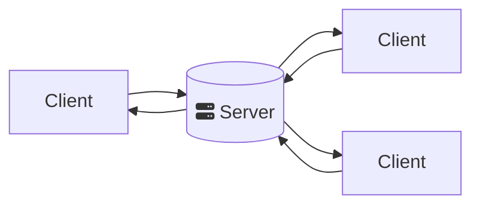
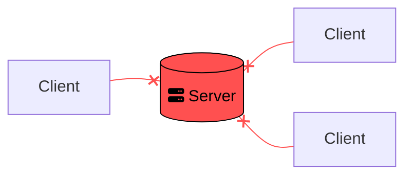
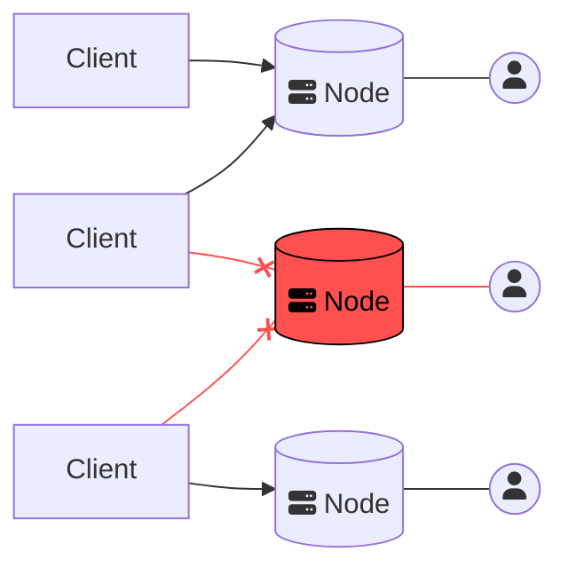

# Pier to Pier networking

Most online services in Web 2.0 follow a simple **client-server** architecture, where a client (the person using the service) makes a request to a centralized server belonging to the service provider. This centralized server then sends a response to your client which satisfies your request.

> **Facebook** is a good example of a client-server model: when you like a post, a request is sent to the Devi- ahem Facebook servers. These in turn register your like and send an updated version of the like count to other users seeing the same post.

_Fig. 1: A typical client-server architecture_

What happens however if this server were to _shut down_? We call this a centralized _vulnerability_.

> **Centralized vulnerability** occurs when a system relies entirely on one of its components to function: if that component were to stop functioning, it would affect the rest of the system.
>
> ex: _Fuel is a centralized vulnerability in a car. If a car runs out of fuel, it stops working. There is no alternative that can fill its role in its place._

In the case of our client-server model, this is an issue since it means that any client, or user, trying to connect to a failing server will not be able to use the service it usually provides.

_Fig. 2: A service which relies on a client-server architecture is vulnerable to outages_

There is an easy solution to this: add more servers! That way if one stops working, another one will be able to take up the work in its place. While this protects us from outages and external malicious attacks, it does not protect us from _internal malicious attacks_.

> Even with multiple redundant servers, there exists a single entity with absolute power over the service it provides. Nothing prevents that entity from abusing that power by choosing to restrict certain users for example, or censoring content it does not approve of.

## Decentralized servers

> **P**ier to **P**ier networking, or (P2P), describes a network in which there resides no central authority with absolute power over the services it provides.
>
> ex: _popular examples of P2P networks include [Gnutella](https://en.wikipedia.org/wiki/Gnutella) and [Bittorent](https://www.bittorrent.com/)._[^1]

P2P networks function by allowing anyone to enter as a server, or Node. Crucially, no Node is treated differently from any other. This way, there is no central point of failure to such networks.

_Fig. 3: A typical P2P network_

Contrarily to the typical client-server model, P2P networks distribute the data and computation they require over every Node in the network, with data being saved in multiple copies. That way, even if a single Node goes offline or is compromised, another Node can take its place.

As you can see in figure 3, even if a single Node in a P2P network goes down, users can simply connect to another Node to access the service provided by the network. Each node can be individually owned by a unique user, with the largest networks boasting millions of users and still no central point of failure.

[^1]: [Napster](https://en.wikipedia.org/wiki/Napster) might also come to mind, however while it utilized P2P techniques, it still relied on a centralized indexing server for retrieving information in the network. While it was still possible for people to set up their own indexing server as was the case during the [Metallica](https://en.wikipedia.org/wiki/Napster#Legal_challenges) debacle, this still meant not all nodes were treated equal, so Napster cannot be considered a 'true' P2P network.
