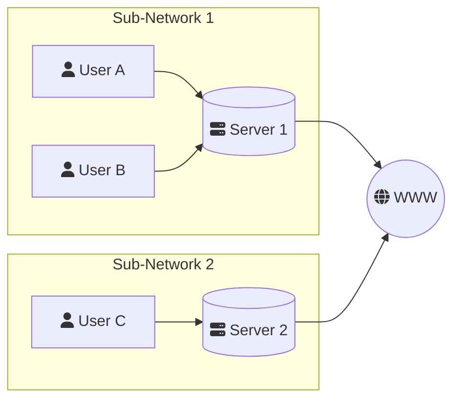
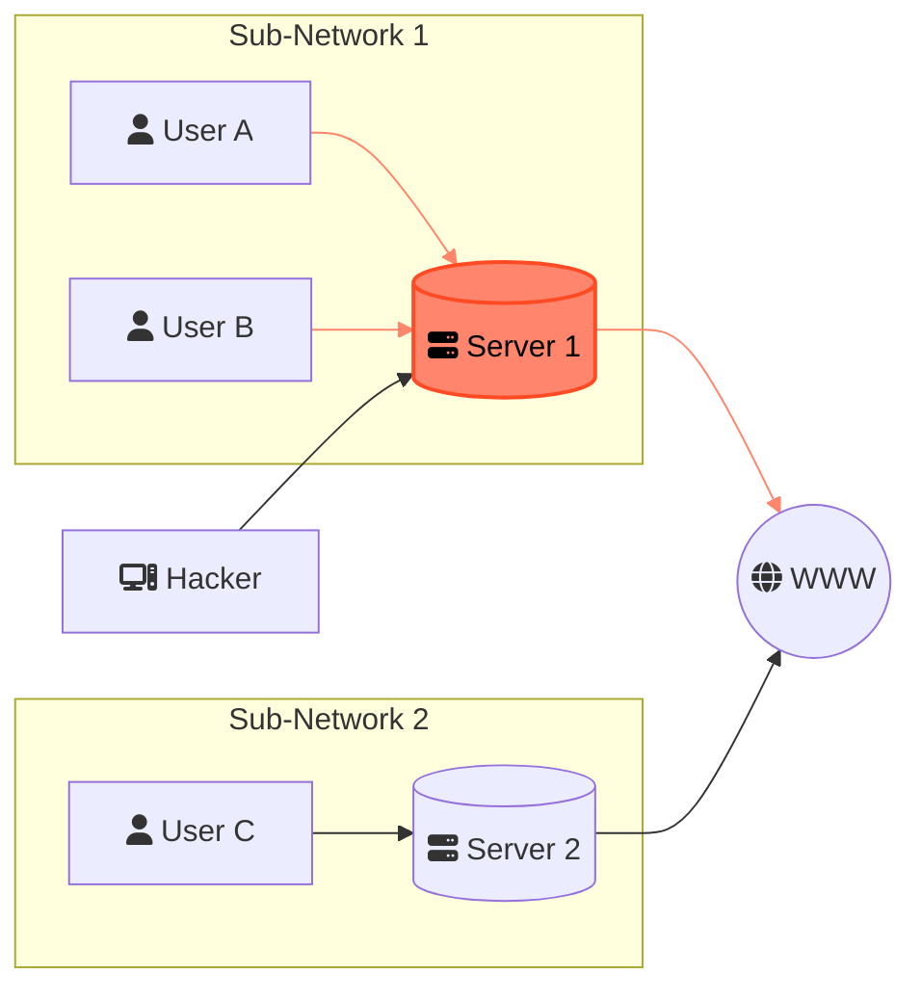

# Information sharing and P2P

As mentioned before, a Blockchain operates in _high adversarial conditions_. That is to say, we have to assume:

- Bad actors will attempt to abuse, break and tamper with a Blockchain.
- There is no way to differentiate a bad actor from a good actor.
- Bad actors might have very high resources and capabilities.

> **High adversarial conditions** describes a state of heightened threat to a system: this means that there might be many people trying very hard to break said system. In the case of Blockchain, this might be hackers, corporations, or even _nations_.

**How can we create a system for sharing information that is resilient under these sort of conditions?** In a traditional Web 2.0 environment, information exchange is centralized: there exists a server, or finite small set of servers that are used to propagate data around the world.

If a server shuts down or is tampered with, because of an error or a malicious attack, then part of a network that relied on that server might stop working as intended. This can be mitigated by having multiple _redundant_ servers so that if it is no longer operating as normal, another will take it's place: kind of like a backup generator.

> We can already begin to see that _redundancy_ is key if we want to create a resilient system.

## Hacking a centralized network

Let's consider the following example: imagine a single network that allows users to connect to the rest of the internet. This network is split into two servers, with three users **A**, **B** and **C** trying to connect to this network.

