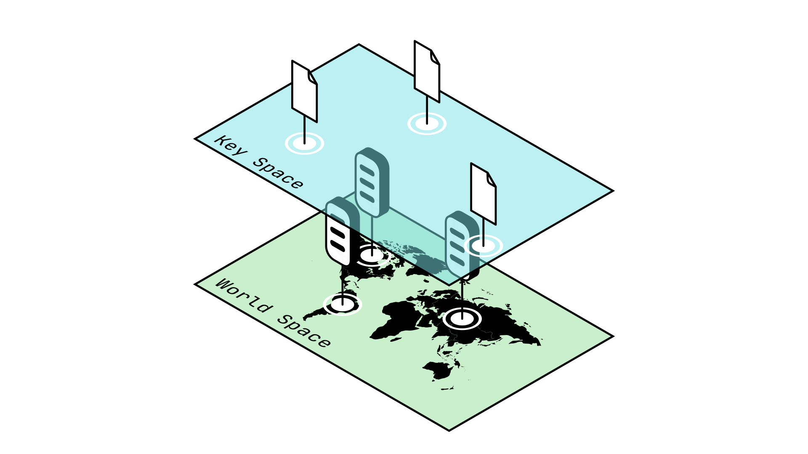

# Identity in P2P networks

P2P networks consist of a _decentralized array of servers_. These Nodes are arranged around the world and owned by many different individuals. When you want to communicate with someone, you can send them a letter (yes, very archaic): for that you need that person's address, which is a form of _identity_. Similarly, for the Nodes in a P2P network to be able to communicate between each other, there needs to be a way to identify them.

> We cannot rely on existing techniques such as IP addresses, since they need to be recognized by a _centralized_ entity to function. Ideally, we want our P2P network to be able to keep functioning _independently of the rest of the web._

As an alternative, each Node issues itself a random number, which acts as a **G**lobal **U**nique **I**dentifier, or **GUID**. But how is this possible? What if two _different Nodes_ issue themselves the _same GUID_? This is known as a **collision**.

> A **collision** in cryptographic terms refers to when a function gives the same output for two different inputs. This is an issue when we need outputs to be unique for identification purposes.
>
> _Collisions are generally seen as vulnerabilities and a potential attack vector._

Consider the following example: you and 4 of your friends are playing a guessing game. You each guess a random number between 1 and 4, and whoever manages to choose a unique number first wins. In this game, it is highly likely for there to be collisions in you answers because the space of possible answers is so small.

Now imagine instead that you and your friends can guess any number between 0 and 1 million. The odds of two players guessing the same number becomes very low, to the point where it is _negligible_ (meaning this is so unlikely to happen we can ignore it).

Similarly, it should be evident that _as long as the amount of possible guesses is much larger than the amount of Nodes in a network_, then the risk of two Nodes guessing the same GUID is very low and even negligible. To achieve this, we use a specific kind of function called a **pseudorandom hash function** to make our random guess.

> A **pseudorandom hash function** is a function whose output is deterministic -that is to say it will always give the same output for a given input- but appears random. This means that if you were to show someone the output of a pseudorandom hash function, they should be unable to tell that the output is deterministic.
>
> _You can see pseudorandom hash functions as a kind of_ scrambler: _such a function takes as an input a number and outputs something vastly different each time, such that each output seems unrelated to the previous one, appearing to be random._

At this point we have determined how to associate a unique address to each Node, but how can we communicate between these Nodes? For that we need to dive deeper into the way P2P networks exchange information.

## Data Hashes

At its heart, the primary service a P2P network provides is a _decentralized way to exchange information_. But how can we locate this information?

If you want to find a book in a library, you refer to it's title, the author that wrote it, and perhaps even the publishing company: all sorts of unique information that make up the book's _identity_. A very _inefficient_ way to search for a book would be to parse through every book in the library and look for one where every letter in it matches the expected value.

Similarly, if you want to access some data stored in a P2P network, you need some way of _identifying_ that data. It would be inefficient to send large amounts of information over the network, so instead we rely on **cryptographic hash functions**.

> A **cryptographic hash function** is a function which satisfies the following properties:
>
> - Given any input it will return an output of fixed (usually small) length.
> - The output of such a function should be _deterministic_.
> - It should have a negligibly low probability of any _collision_ occurring.
>
> The input passed to a cryptographic hash function can be many things: a number, a very long text, or some other kind of information.

Let's break this down step by step.

1. First of all, the output of a cryptographic hash function is generally much smaller than it's input: in that way it allows us to shorten the identity of the data we are passing to it, similarly to how the title of a book and it's author provide a shorter identity when compared to the entire contents of the book itself.

2. Since this output is _deterministic_, this means that given the same input we will always get the same output from a cryptographic hash function. This is important since we want to use this output as a guarantee of identity: it would be inconvenient if that identity were to change each time we used it.

3. Finally, the probability of a collision occurring with a cryptographic hash function should be _negligibly low_. This is important because we do not want malicious actors to be able to create duplicate or false identities.

> Among many other things, cryptographic hash functions can be seen as a _guarantee of authenticity_. They allow us to represent the identity of any kind of data in a short and concise way that is unique to that input.

Using a cryptographic hash function, we can generate unique identifiers for the information we want to store on our network. This is refereed to as **hashing**, which generates a unique **identifier**, or **hash**, for that information.

Now, if someone wants to access that information, they can generate its hash themselves and ask around the network until they find a Node which is storing that hash, at which point it will return the information associated with that hash.

> We have essentially created a custom titling schema that allows us to easily retrieve the information which we store in our decentralized library of a P2P network.

## Keyspace and Worldspace

So far we have seen:

- How to identify Nodes using a GUID based off a _pseudorandom hash function_.
- How to identify information stored on the network using data hashes generated with a _cryptographic hash functions_.

This presents a major discrepancy however: how do we handle GUIDs and the hashes of the information stored on our network (also referred to as _keys_)? We must begin by understanding two very important concepts: **Worldspace** and **Keyspace**.

> **Worldspace** describes the set of all coordinates used to indicate the location of an object in the real, physical world.
> 
> **Keyspace** describes the set of all coordinates, or hashes, used to indicate a location in a P2P network.

It is important to note that while GUIDs describe Nodes which are located in the physical world (ie: _Worldspace_), the hashes or keys of the data in our network are being stored in _Keyspace_. In more mathematical terms, you can see Worldspace as the set of all possible GUIDs, while Keyspace is the set of all possible hashes.

_Fig. 1: Worldspace is incompatible with Keyspace_

While this might not seem like an issue at first, consider that at the moment only the nodes themselves are aware of their own GUID. _We will need a way to transmit GUIDs between nodes in the network_, similarly to how we might request other data.

This becomes complicated if GUIDs are a different data type as compared to the hashes stored on the network in Keyspace, as this would require special treatment. Ideally, we would like GUIDs to be compatible with Keyspace, so we can treat them the same way as the data hashes already present.

You can think of this in the same way as vectors are incompatible with real numbers: it makes no sense to add a vector and a number together, and so we need special rules to interact between these two worlds. This makes our problems more complicated. Similarly to how it would be simpler if we could consider all real numbers as vectors, we would like for GUIDs and data hashes to be compatible.

> Storing GUIDs in Keyspace proves very useful for other reasons, as it allows us to operate on GUIDs and data hashes together. For example, it allows us to define the _distance_ between a Node's GUID and the data hashes around it, which proves essential to many P2P algorithms such as [Kademlia](./Kademlia.md).

In general, we would like to be able to reason about GUIDs and data hashes together, not separately.

_Fig. 2: Moving GUIDs to Keyspace allows us to operate on GUIDs and data hashes simultaneously_

This is all very mathematical, so I will try and break it down into simpler terms:

- The issue at hand is that we have two different data types: GUIDs, and data hashes. These data types are not necessarily compatible: GUIDs apply to objects in the real world, in Worldspace, while data hashes apply to information we store in a P2P network, in Keyspace.

- Here, Worldspace can be seen as all the possible values of our _pseudorandom hash function_, and Keyspace as all the possible value of our _cryptographic hash function_. These can be very different, which makes them incompatible, like vectors and real numbers: this is an issue, as discussed before.

- We want the _cryptographic hash function_ we use to generate GUIDs to be compatible with the _pseudorandom hash function_ used to generate data hashes. In the same ways that negative numbers are compatible with positive numbers, we want GUIDs to be compatible with data hashes. 
> **This can be achieved by using the same function to generate both GUIDs and data hashes.**

## Benefits of Identity in P2P Networks

Establishing identity in a P2P network through GUIDs for Nodes and hashes for the data we store in our network allows for the easy and efficient exchange of information between Nodes, while the combination of GUIDs and data hashes into the same space allows for easy comparison and operations between the two.

These are the first steps in the algorithms which form the base of the many existing P2P protocols, so it is important you grow familiar with them: they will be instrumental in understanding the following sections on [Chord](./chord.md) and [Kademlia](./Kademlia.md).
